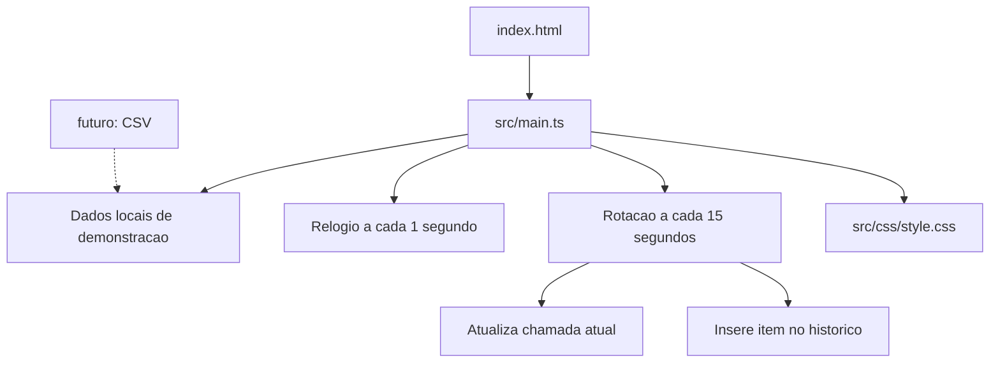

# Guia Principal do Projeto

Este e o ponto de entrada para estudar, manter e orientar IAs no Painel de Chamadas APAE. Leia este arquivo primeiro. Depois, abra apenas o documento relacionado a tarefa.

## 1. O que e o projeto

Um painel web leve para uma sala de espera. A tela mostra uma chamada atual, um historico curto, um relogio e avisos institucionais. A implementacao atual e uma demonstracao local: as chamadas estao em um array TypeScript e a troca acontece a cada 15 segundos.

Tecnologias atuais:

- HTML semantico;
- CSS tradicional com variaveis e media queries;
- TypeScript vanilla;
- Vite para desenvolvimento e build;
- Google Fonts e Material Symbols carregados no HTML.

Nao existe ainda um backend conectado, uma API ou um sincronizador Python implementado.

## 2. Mapa de leitura

### Para comecar a usar

1. [README.md](README.md): instalacao, comandos e visao geral.
2. [frontend/index.html](frontend/index.html): estrutura da tela.
3. [frontend/src/main.ts](frontend/src/main.ts): comportamento.
4. [frontend/src/css/style.css](frontend/src/css/style.css): aparencia e responsividade.

### Para aprender

- [frontend/EXPLICACAO.md](frontend/EXPLICACAO.md): explicacao passo a passo do codigo atual.
- [frontend/PLANO.md](frontend/PLANO.md): exercicios e evolucoes em ordem.
- [análise_atual_e_melhorias.md](análise_atual_e_melhorias.md): justificativa da refatoracao inicial.

### Para manter consistencia

- [AGENTS.md](AGENTS.md): regras para pessoas e IAs, limites da arquitetura e checklist de alteracoes.
- [DESIGN.md](DESIGN.md): direcao visual, contraste, tipografia e layout.

### Para a futura integracao de dados

- [frontend/src/core/csv-parser.ts](frontend/src/core/csv-parser.ts): parser CSV independente.
- [frontend/src/core/types.ts](frontend/src/core/types.ts): interfaces do dominio em evolucao.
- [sync/requirements.txt](sync/requirements.txt): dependencias previstas do sincronizador Python.
- [sync/.env.example](sync/.env.example): exemplo das configuracoes de planilhas.

## 3. Fluxo da aplicacao



O navegador carrega o HTML, que importa `main.ts`. O TypeScript inicializa o relogio e o historico. Depois, os temporizadores atualizam a tela sem recarregar a pagina.

## 4. Como executar

```bash
cd frontend
npm install
npm run dev
```

Para verificar o projeto:

```bash
cd frontend
npm run build
```

O build executa o compilador TypeScript estrito e o build de producao do Vite. Sempre rode esse comando depois de alterar codigo.

## 5. Como decidir onde editar

| Objetivo | Arquivo |
|---|---|
| Mudar a estrutura ou texto fixo da tela | `frontend/index.html` |
| Mudar chamadas, relogio, rotacao ou DOM | `frontend/src/main.ts` |
| Mudar cores, dimensoes, layout ou animacoes | `frontend/src/css/style.css` |
| Mudar leitura de CSV | `frontend/src/core/csv-parser.ts` |
| Mudar contratos de dados futuros | `frontend/src/core/types.ts` |
| Mudar regras para IAs e manutencao | `AGENTS.md` |
| Registrar uma nova etapa de implementacao | `frontend/PLANO.md` |

Nao misture responsabilidades: nao coloque CSS inline no HTML nem logica de negocio dentro de `style.css`.

## 6. Ordem recomendada de aprendizado

1. HTML: siga os elementos semanticos e os IDs usados pelo TypeScript.
2. CSS: altere uma variavel de cor e observe o layout desktop/mobile.
3. TypeScript: altere o array `calls` e acompanhe `rotateCall()`.
4. DOM: estude como `getElement()`, `textContent` e `renderHistory()` atualizam a pagina.
5. CSV: leia o parser e depois conecte um arquivo em `frontend/public/`.
6. Arquitetura: só depois extraia relogio, rotacao e renderizacao para modulos separados.

## 7. Auditoria dos arquivos

### Mantidos com funcao clara

- `README.md`: entrada rapida e comandos.
- `AGENTS.md`: contexto operacional para IAs e colaboradores.
- `DESIGN.md`: sistema visual.
- `análise_atual_e_melhorias.md`: historico e motivacao da refatoracao.
- `frontend/EXPLICACAO.md`: material didatico.
- `frontend/PLANO.md`: plano atual de evolucao.
- `sync/requirements.txt` e `sync/.env.example`: preparacao da futura sincronizacao.
- `frontend/wireframe/`: material visual; revisar manualmente antes de remover.

### Removidos com seguranca

- `detalhado-painel-chamadas.md`: especificacao antiga com exemplos de `main.py`, Tailwind e layout que nao correspondem ao codigo atual. Nao havia referencias a ele.
- `plan/frontend-implementation-plan.md`: plano antigo substituido por `frontend/PLANO.md`. Tambem nao havia referencias a ele.

A pasta `plan/` pode ser removida depois de confirmada como vazia. Ela foi mantida apenas para nao transformar uma limpeza de documentacao em uma remocao estrutural desnecessaria.

### Nao remover automaticamente

- `frontend/src/`: codigo da aplicacao.
- `frontend/package.json`, `package-lock.json`, `tsconfig.json` e `vite.config.ts`: configuracao e build.
- `sync/`: ainda nao integrado, mas faz parte da direcao offline planejada.
- `análise_atual_e_melhorias.md`: pode ser arquivado no futuro, mas ainda explica por que as decisoes atuais foram tomadas.

## 8. Regras para uma IA trabalhar aqui

Antes de editar, leia este arquivo e [AGENTS.md](AGENTS.md). Confirme o arquivo que realmente controla o comportamento. Faca a menor alteracao possivel, preserve mudancas existentes e execute `cd frontend && npm run build` ao terminar. Nao invente API, backend ou arquivos CSV conectados se eles ainda nao estiverem implementados.
